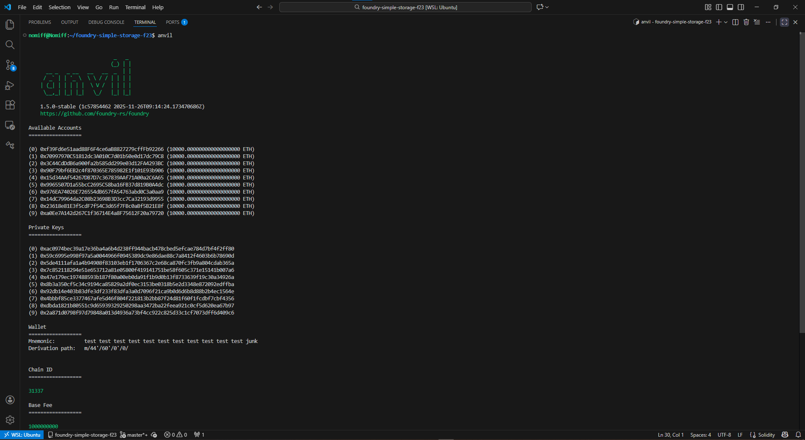
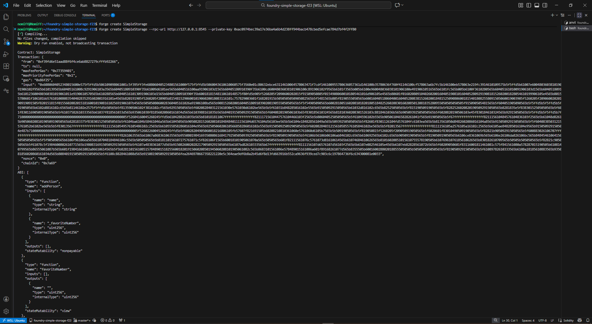
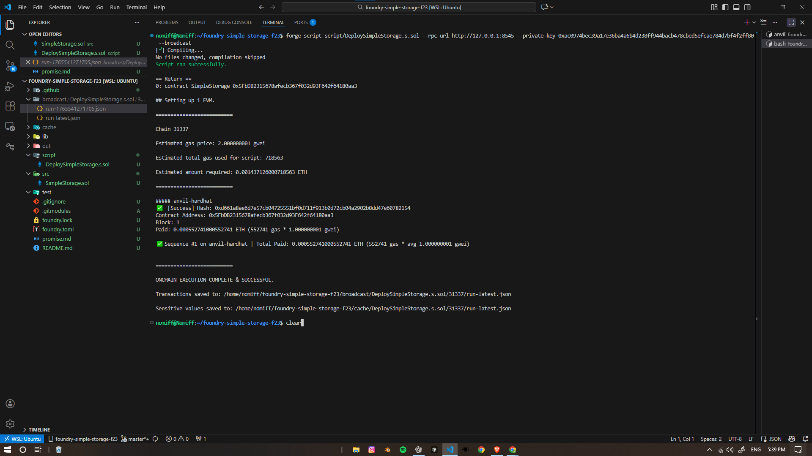
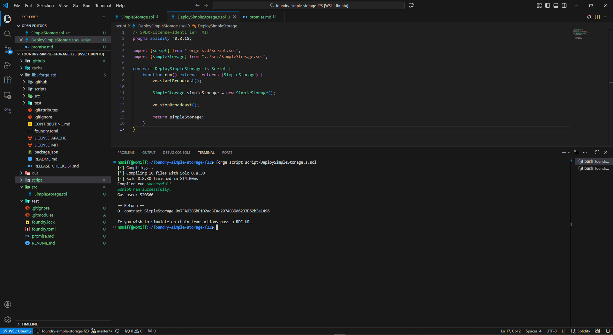
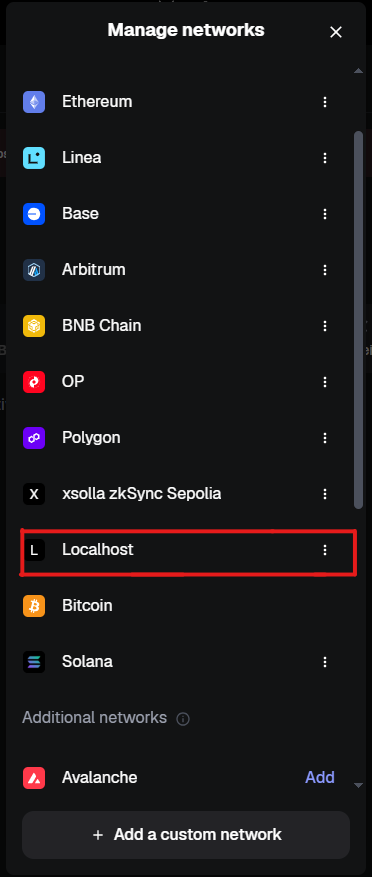

# Proof of Work — Foundry + Anvil (SimpleStorage)

## Summary  
Local dev run: Foundry (forge) + Anvil used on WSL to compile, script-deploy, and interact with a `SimpleStorage` contract. This repository contains code + screenshots showing the full flow.

---

## Steps Performed
1. WSL + Foundry install  
2. `anvil` started → noted RPC & private keys  
3. `forge init` → wrote `src/SimpleStorage.sol`  
4. Wrote `script/DeploySimpleStorage.s.sol` using `vm.startBroadcast()` / `vm.stopBroadcast()`  
5. `forge script script/DeploySimpleStorage.s.sol --rpc-url http://127.0.0.1:8545 --private-key <key> --broadcast`  
6. Imported Anvil private key to MetaMask (custom network http://127.0.0.1:8545)  
7. Verified contract deployed and interacted (cast / script)

---

## Screenshots / Proof

### 1. Anvil Output (RPC + Private Keys)


### 2. Deployment Script Running


### 3. Compilation Success


### 4. Script File in VS Code


### 5. Deployment Output (Contract Address)


### 6. MetaMask Custom Network + Imported Account


> ⚠️ NOTE: Do not publish real private keys publicly.  
> These keys are auto-generated by Anvil & for local testing only.

---

## Commands Used

```bash
# run local node
anvil

# in new terminal — init + build
forge init
forge build

# deploy with private key from Anvil output
forge script script/DeploySimpleStorage.s.sol \
  --rpc-url http://127.0.0.1:8545 \
  --private-key 0x... \
  --broadcast

# optional: call or send via `cast`
cast call <contract> "retrieve()(uint256)" --rpc-url http://127.0.0.1:8545
cast send <contract> "store(uint256)" 123 \
  --rpc-url http://127.0.0.1:8545 \
  --private-key 0x...
